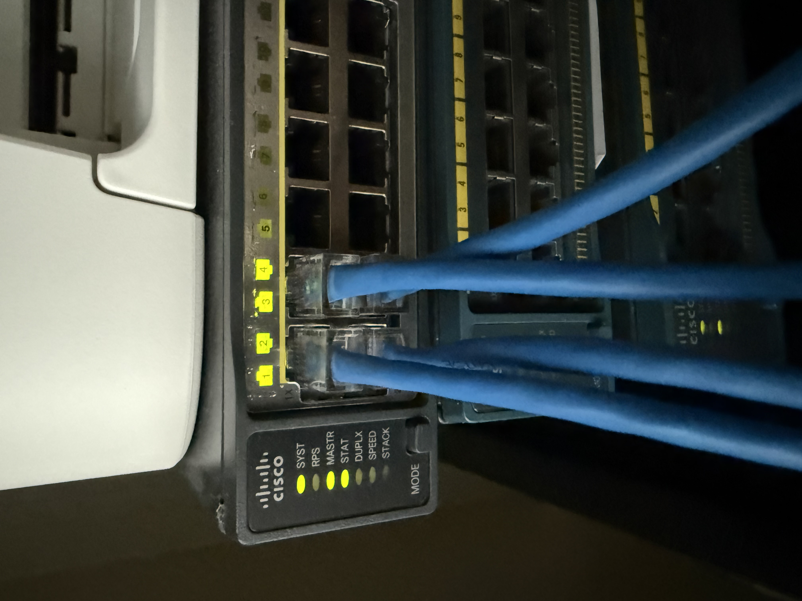

## IP Addressing

| Device | Interface | IP Address | Role |
|--------|-----------|------------|------|
| SW1 | VLAN 1 | 10.0.1.1/24 | Distribution switch |
| SW2 | VLAN 1 | 10.0.1.2/24 | Access switch |
| R1 | Gi0/0 | 10.0.1.254/24 | Default gateway |
| R1 | Gi0/1 | 10.0.2.1/30 | R1-R2 link |
| R2 | Gi0/0 | 10.0.1.253/24 | Secondary router |
| R2 | Gi0/1 | 10.0.2.2/30 | R1-R2 link |
| Laptop | ETH | 10.0.1.100/24 | Management workstation |

## Hardware Evidence

STP blocking port shown as amber on physical switch:

