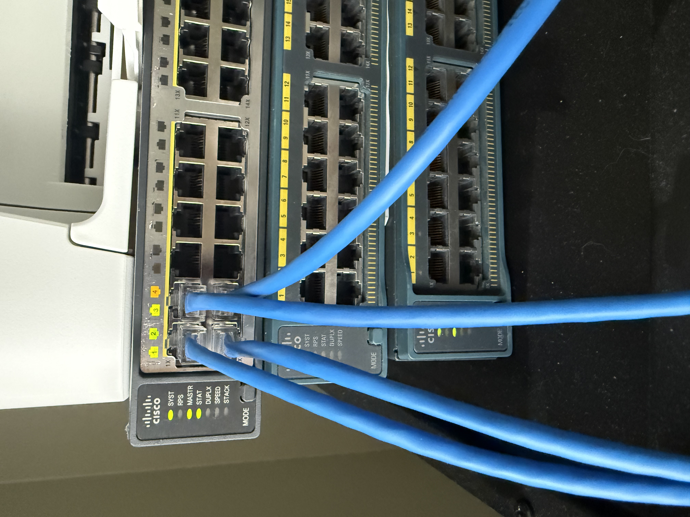
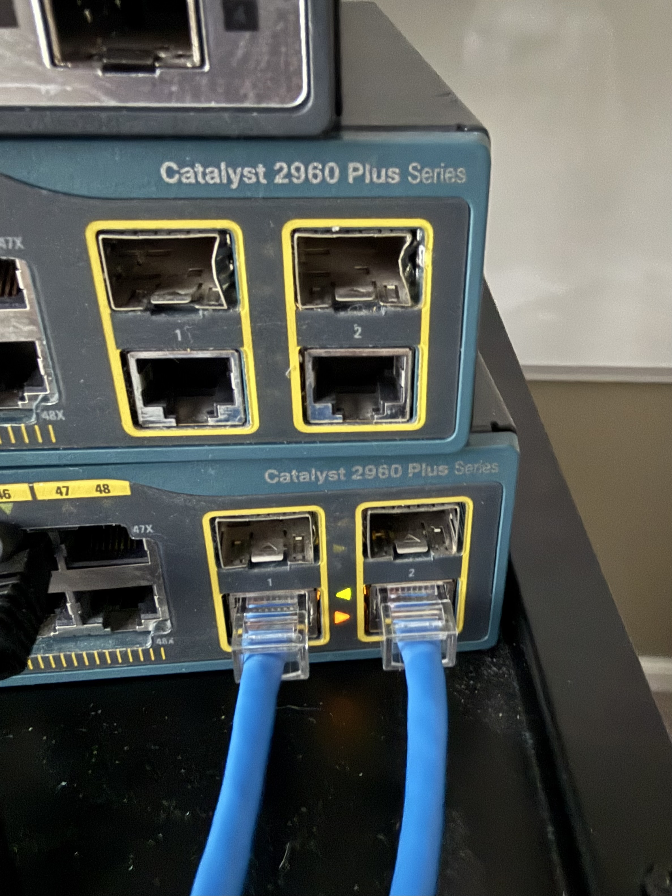

## IP Addressing

| Device | Interface | IP Address | Role |
|--------|-----------|------------|------|
| SW1 | VLAN 1 | 10.0.1.1/24 | Distribution switch |
| SW2 | VLAN 1 | 10.0.1.2/24 | Access switch |
| R1 | Gi0/0 | 10.0.1.254/24 | Default gateway |
| R1 | Gi0/1 | 10.0.2.1/30 | R1-R2 link |
| R2 | Gi0/0 | 10.0.1.253/24 | Secondary router |
| R2 | Gi0/1 | 10.0.2.2/30 | R1-R2 link |
| Laptop | ETH | 10.0.1.100/24 | Management workstation |

## What Was Observed

### Before Priority Manipulation
- SW2 elected root bridge — lowest MAC address won
- SW1 Fa1/0/4 placed in blocking state (amber port light)
- SW1 Fa1/0/3 elected root port — best path to SW2

### After Priority Manipulation
- SW1 priority set to 4096 via:
  spanning-tree vlan 1 priority 4096
- SW1 became root bridge
- STP reconverged — different port now blocking
- Confirmed with show spanning-tree

## Hardware Evidence

This screenshot shows STP placing a redundant link into the blocking state to prevent a Layer 2 loop.

## Root Bridge Election

This screenshot shows SW1 becoming the root bridge after modifying bridge priority.

## STP Recalculates After Root Bridge Change

After changing the bridge priority and making SW1 the root bridge, STP recalculated the topology. The blocking port moved to SW2, demonstrating how STP dynamically selects the optimal forwarding and blocking paths while preventing Layer 2 loops.

## Issue 1 — Cannot Ping 10.0.2.0/30 From Laptop
**Symptom:** Pings to the R1-R2 link subnet 10.0.2.0/30 timed out from the management laptop despite correct device configurations.
**What Made It Confusing:** The directly connected management subnet 10.0.1.0/24 was fully reachable — all four devices responded to pings normally. This initially pointed suspicion toward routing or firewall issues on the devices rather than the laptop itself.
**Tools Used:** ping, tracert, route print, ipconfig
**Diagnosis:** tracert 10.0.2.1 revealed traffic exiting via home WiFi to Spectrum rather than the lab ethernet adapter. route print confirmed two competing default routes — WiFi metric (35) lower than lab adapter metric (291).
**Root Cause:** 10.0.1.0/24 worked because it was directly connected — Windows bypasses the default route for directly connected subnets. Traffic to 10.0.2.0/30 required a gateway, and Windows chose the WiFi default route instead of the lab adapter.
**Fix:**
route add 10.0.2.0 mask 255.255.255.252 10.0.1.254
**Lesson:** Always verify the routing table on the management workstation before troubleshooting network devices. The problem was never on the network — it was on the host.Sonnet 4.6 Low

