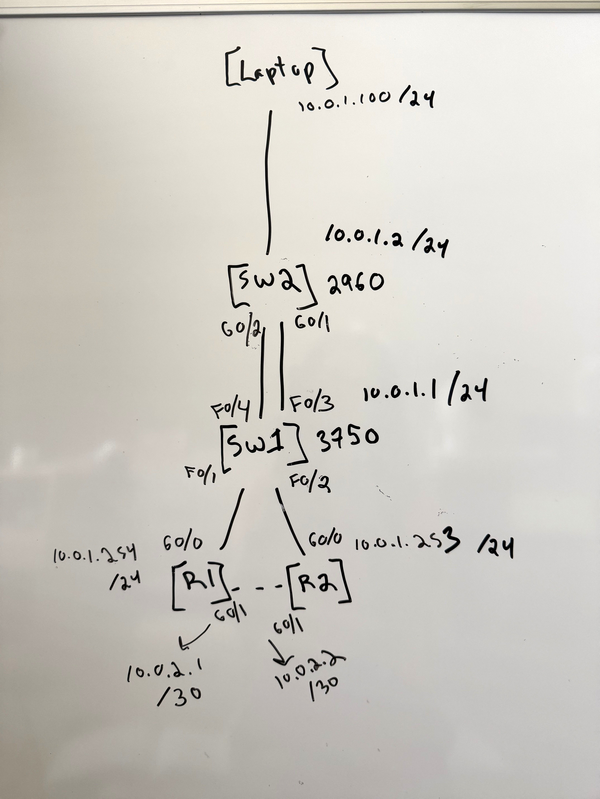

# Lab 01 — Spanning Tree Protocol

## Overview
This lab demonstrates Spanning Tree Protocol (STP) 
on physical Cisco hardware. Two Catalyst switches are 
connected with dual uplinks creating a Layer 2 loop. 
STP automatically detects the loop and places one port 
in blocking state to prevent a broadcast storm. The lab 
then demonstrates manual root bridge manipulation by 
overriding the default election process using bridge 
priority, forcing SW1 to become the root bridge and 
observing STP reconvergence.

## Hardware
- 1x Cisco Catalyst 3750 v2 (SW1) — distribution layer
- 1x Cisco Catalyst 2960-Plus (SW2) — access layer
- 2x Cisco 2901 Routers (R1, R2) — connected as edge devices
- 1x Windows Laptop — management workstation

## Topology

## IP Addressing
| Device | Interface | IP Address | Role |
|--------|-----------|------------|------|
| SW1 | VLAN 1 | 10.0.1.1/24 | Distribution switch |
| SW2 | VLAN 1 | 10.0.1.2/24 | Access switch |
| R1 | Gi0/0 | 10.0.1.254/24 | Default gateway |
| R1 | Gi0/1 | 10.0.2.1/30 | R1-R2 link |
| R2 | Gi0/0 | 10.0.1.253/24 | Secondary router |
| R2 | Gi0/1 | 10.0.2.2/30 | R1-R2 link |
| Laptop | ETH | 10.0.1.100/24 | Management workstation |

## What Was Observed

### Before Priority Manipulation
- SW2 elected root bridge — lowest MAC address won
- SW1 Fa1/0/4 placed in blocking state (amber port light)
- SW1 Fa1/0/3 elected root port — best path to SW2

### After Priority Manipulation
- SW1 priority set to 4096 via: spanning-tree vlan 1 priority 4096
- SW1 became root bridge
- STP reconverged — blocking port moved to SW2
- Confirmed with `show spanning-tree`

## Hardware Evidence

SW1 Fa1/0/4 placed in blocking state — amber port light 
confirms STP is actively preventing a Layer 2 loop.

SW1 becomes root bridge after priority manipulation 
via `spanning-tree vlan 1 priority 4096`.

After SW1 becomes root bridge, STP reconverges and 
the blocking port moves to SW2, demonstrating dynamic 
path selection.

## Troubleshooting

### Issue 1 — Cannot Ping 10.0.2.0/30 From Laptop

**Symptom:** Pings to the R1-R2 link subnet `10.0.2.0/30`
timed out from the management laptop despite correct 
device configurations.

**What Made It Confusing:** The directly connected 
management subnet `10.0.1.0/24` was fully reachable — 
all four devices responded to pings normally. This 
initially pointed suspicion toward the devices rather 
than the laptop itself.

**Initial Investigation:** Windows Firewall was the 
first suspect. A rule was added to allow inbound ICMPv4:
netsh advfirewall firewall add rule name="Allow ICMPv4" protocol=icmpv4:8,any dir=in action=allow
Pings still failed, ruling out the firewall and shifting 
investigation toward the routing table.

**Tools Used:** `ping`, `tracert`, `route print`, `ipconfig`

**Diagnosis:** `tracert 10.0.2.1` revealed traffic 
exiting via home WiFi to Spectrum rather than the lab 
ethernet adapter. `route print` confirmed two competing 
default routes — WiFi metric (35) lower than lab adapter 
metric (291).

**Root Cause:** `10.0.1.0/24` worked because it was 
directly connected — Windows bypasses the default route 
for directly connected subnets. Traffic to `10.0.2.0/30` 
required a gateway, and Windows chose the WiFi default 
route instead of the lab adapter.

**Fix:** Added a persistent static route for the lab subnet:
route add -p 10.0.2.0 mask 255.255.255.252 10.0.1.254

**Lesson:** Always verify the routing table on the 
management workstation before troubleshooting network 
devices. The problem was never on the network — 
it was on the host.

