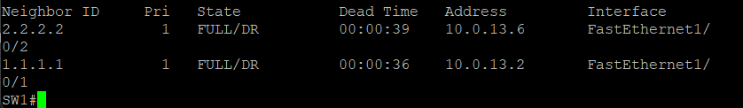

## Design Decisions

I chose a Layer 3 switch (SW1) in this topology so I 
could gain experience using a multilayer switch as a 
routing boundary and better understand the design 
implications of that approach.

My initial plan was to configure all of SW1's ports as 
routed ports. However, I realized that the link to the 
downstream access switch would then only support a single 
IP subnet. Any endpoints connected to the access switch 
would need to share that subnet, which seemed inflexible 
in a real enterprise environment where multiple VLANs are 
often used to separate user groups, enforce security 
boundaries, and contain layer 2 broadcast traffic such as 
ARP and DHCP requests so that devices spend less time 
processing traffic that is not relevant to their operation.
Multiple VLANs will also improve scalability as the number
of endpoints grow"

SO I configured a trunk link between SW1 and the 
access switch and implemented SVIs on SW1 to provide 
inter-VLAN routing. This design allows additional VLANs 
to be extended to the access layer in the future without 
redesigning the Layer 3 boundary or changing the default 
gateway configuration on existing endpoints. As the 
network grows, new VLANs can be added while maintaining 
a consistent routing architecture.

Using SW1 as a Layer 3 switch also creates multiple 
routed networks within the topology, providing a more 
realistic environment for the main point of this lab which is OSPF 
route advertisements, route exchange, and routing 
protocol behavior.

## Future Labs — IPv6

Future labs will build on this topology by introducing 
IPv6 routing. Similar to the way VLAN segmentation helps 
contain unnecessary Layer 2 traffic, IPv6 introduces a 
more modern approach to host discovery and addressing 
through Neighbor Discovery Protocol (NDP) and greatly 
reduces the need for NAT. Expanding this lab to include 
IPv6 will provide an opportunity to observe routing 
behavior, Neighbor Discovery, and dual-stack operation 
while exploring how modern networks can be designed to 
scale more efficiently and with less operational 
complexity.

## Lab Host Routing

In a previous lab, my topology contained only one subnet 
that was not directly connected to my laptop. Rather than 
changing the metric of my existing home Wi-Fi default 
route, I simply added a static route on my laptop to 
reach the additional lab network. In this topology, 
however, there are several downstream networks. Instead 
of creating a static route for each subnet, I lowered 
the metric of the lab default gateway so my laptop could 
automatically reach all networks within the lab 
environment.

## Working on Physical Equipment

There are benefits to working on physical equipment 
rather than a simulated environment. In addition to 
configuring switches and routers, I had to configure 
my endpoint device and account for competing routes 
from my home network. The lab also provides experience 
with SSH management, understanding the packet flow 
required to establish remote access, and knowing when 
SSH can be used instead of a console connection. It 
has also helped me recognize situations where a console 
cable is still necessary.

## Loopback Addresses

I finally experienced the value of loopback addresses. 
Unlike a physical interface, a loopback remains reachable 
as long as at least one path to the router exists, making 
it a stable address for management and routing protocols. 
Loopbacks also make excellent OSPF Router IDs, and 
assigning them meaningful addresses makes it much easier 
to identify neighbors when reviewing commands such as 
`show ip ospf neighbor`.

## OSPF DR/BDR Election Observation

I observed that SW1 lost the OSPF DR election despite 
having the highest Router ID (`3.3.3.3`) because it was 
the last device to join the OSPF domain. R1 and R2 had 
already completed the DR/BDR election, and OSPF elections 
are non-preemptive — a new router cannot claim DR simply 
by having a higher Router ID if the election has already 
taken place.

## OSPF DR/BDR Election Evidence

SW1 (`3.3.3.3`) holds the highest Router ID in the 
topology yet lost the DR election on both routed port 
segments — R1 (`1.1.1.1`) and R2 (`2.2.2.2`)

Two lessons I will carry forward from this lab:

- Prefer `ip ospf network point-to-point` on /30 links 
  where appropriate to avoid unnecessary DR/BDR elections 
  on segments that will never have more than two routers
- Explicitly configure OSPF priorities rather than relying 
  on default election behavior — use `ip ospf priority 255` 
  on devices that should always be DR and 
  `ip ospf priority 0` on devices that should never 
  become DR
