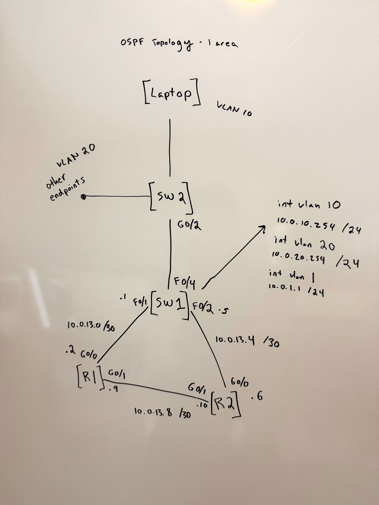
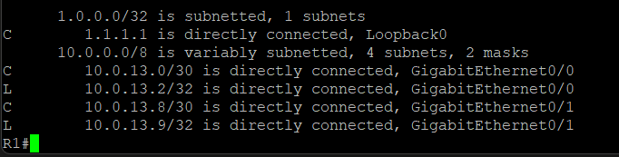
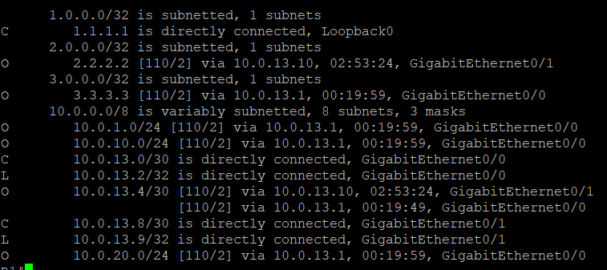
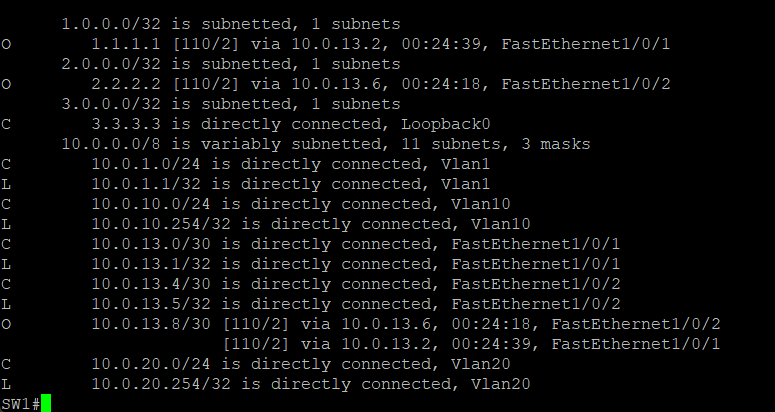
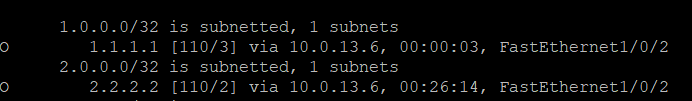

# Lab 02 — OSPF and Layer 3 Routing

## Overview
This lab builds on the STP topology by converting the 
network to a fully routed Layer 3 design. The SW1-SW2 
link becomes an 802.1Q trunk supporting multiple VLANs, 
SW1's uplinks to R1 and R2 become routed ports with /30 
subnets, and OSPF area 0 provides dynamic routing between 
all devices. The lab demonstrates OSPF neighbor adjacency, 
route advertisement, and path failover.

## Hardware
- 1x Cisco Catalyst 3750 v2 (SW1) — distribution layer, 
  Layer 3 routing
- 1x Cisco Catalyst 2960-Plus (SW2) — access layer, 
  802.1Q trunk
- 2x Cisco 2901 Routers (R1, R2) — OSPF routing
- 1x Windows Laptop — management workstation

## Topology

## IP Addressing

| Device | Interface | IP Address | Subnet | Purpose |
|--------|-----------|------------|--------|---------|
| SW1 | VLAN 1 | 10.0.1.1/24 | Management | SSH access |
| SW1 | VLAN 10 | 10.0.10.254/24 | Users | Gateway |
| SW1 | VLAN 20 | 10.0.20.254/24 | Servers | Gateway |
| SW1 | Fa1/0/1 | 10.0.13.1/30 | SW1-R1 | Routed port |
| SW1 | Fa1/0/2 | 10.0.13.5/30 | SW1-R2 | Routed port |
| SW1 | Lo0 | 3.3.3.3/32 | Loopback | Router ID |
| SW2 | VLAN 1 | 10.0.1.2/24 | Management | SSH access |
| R1 | Gi0/0 | 10.0.13.2/30 | SW1-R1 | Routed link |
| R1 | Gi0/1 | 10.0.13.9/30 | R1-R2 | Routed link |
| R1 | Lo0 | 1.1.1.1/32 | Loopback | Router ID |
| R2 | Gi0/0 | 10.0.13.6/30 | SW1-R2 | Routed link |
| R2 | Gi0/1 | 10.0.13.10/30 | R1-R2 | Routed link |
| R2 | Lo0 | 2.2.2.2/32 | Loopback | Router ID |
| Laptop | ETH | 10.0.1.100/24 | Management | Workstation |

## Design Decisions

I chose a Layer 3 switch (SW1) in this topology so I 
could gain experience using a multilayer switch as a 
routing boundary and better understand the design 
implications of that approach.

My initial plan was to configure all of SW1's ports as 
routed ports. However, I realized that the link to the 
downstream access switch would then only support a single 
IP subnet. Any endpoints connected to the access switch 
would need to share that subnet, which seemed inflexible 
in a real enterprise environment where multiple VLANs are 
often used to separate user groups, enforce security 
boundaries, and limit the spread of broadcast traffic so 
that devices spend less time processing unnecessary 
network traffic.

Instead, I configured a trunk link between SW1 and the 
access switch and implemented SVIs on SW1 to provide 
inter-VLAN routing. This design allows additional VLANs 
to be extended to the access layer in the future without 
redesigning the Layer 3 boundary or changing the default 
gateway configuration on existing endpoints. As the 
network grows, new VLANs can be added while maintaining 
a consistent routing architecture.

Using SW1 as a Layer 3 switch also creates multiple 
routed networks within the topology, providing a more 
realistic environment for the OSPF protocol. 

## Working on Physical Equipment

There are benefits to working on physical equipment 
rather than a simulated environment. In addition to 
configuring switches and routers, I had to configure 
my endpoint device and account for competing routes 
from my home network. The lab also provides experience 
with SSH management, understanding the packet flow 
required to establish remote access, and knowing when 
SSH can be used instead of a console connection. It 
has also helped me recognize situations where a console 
cable is still necessary.

## Lab Host Routing

In a previous lab, my topology contained only one subnet 
that was not directly connected to my laptop. Rather than 
changing the metric of my existing home Wi-Fi default 
route, I simply added a static route on my laptop to 
reach the additional lab network. In this topology, 
however, there are several downstream networks. Instead 
of creating a static route for each subnet, I lowered 
the metric of the lab default gateway so my laptop could 
automatically reach all networks within the lab 
environment.

## OSPF Configuration

OSPF process 1 was configured on all three Layer 3 
devices — SW1, R1 and R2 — with all connected networks 
advertised into area 0. Loopback interfaces were 
advertised using a /32 wildcard mask of `0.0.0.0` to 
ensure the stable router ID addresses were reachable 
across the topology.

## Routing Tables

### R1 Before OSPF

Before OSPF was configured, R1 only had directly 
connected routes — no knowledge of any other subnets 
in the topology.

### R1 After OSPF Convergence

After OSPF converged, R1's routing table shows all 
subnets in the topology learned via OSPF — including 
SW1's VLAN subnets, R2's loopback, and equal-cost 
paths to the SW1-R2 link via both SW1 and R2.

## Loopback Addresses

I finally experienced the value of loopback addresses. 
Unlike a physical interface, a loopback remains reachable 
as long as at least one path to the router exists, making 
it a stable address for management and routing protocols. 
Loopbacks also make excellent OSPF Router IDs, and 
assigning them meaningful addresses makes it much easier 
to identify neighbors when reviewing commands such as 
`show ip ospf neighbor`.

## OSPF DR/BDR Election Observation

I observed that SW1 lost the OSPF DR election despite 
having the highest Router ID (`3.3.3.3`) because it was 
the last device to join the OSPF domain. R1 and R2 had 
already completed the DR/BDR election, and OSPF elections 
are non-preemptive — a new router cannot claim DR simply 
by having a higher Router ID if the election has already 
taken place.

SW1 (`3.3.3.3`) holds the highest Router ID in the 
topology yet lost the DR election on both routed port 
segments — R1 (`1.1.1.1`) and R2 (`2.2.2.2`) are shown 
as DR on their respective segments. This demonstrates 
the non-preemptive nature of OSPF DR elections — the 
first router to come up on a segment wins regardless 
of Router ID.

Two lessons I will carry forward from this lab:

- Prefer `ip ospf network point-to-point` on /30 links 
  where appropriate to avoid unnecessary DR/BDR elections 
  on segments that will never have more than two routers
- Explicitly configure OSPF priorities rather than relying 
  on default election behavior — use `ip ospf priority 255` 
  on devices that should always be DR and 
  `ip ospf priority 0` on devices that should never 
  become DR

## OSPF Failover Demonstration

To demonstrate OSPF reconvergence, FastEthernet1/0/1 
on SW1 (the direct link to R1) was administratively 
shut down.

### Before Failover

SW1 reached R1's loopback `1.1.1.1` via the direct 
link — next hop `10.0.13.2` on Fa1/0/1.

### After Failover

OSPF detected the link failure and reconverged 
automatically. SW1's route to R1's loopback `1.1.1.1` 
changed to next hop `10.0.13.6` (R2's Gi0/0) — traffic 
now travels SW1 → R2 → R1 rather than the direct path.

### What This Demonstrates
- OSPF automatically recalculates the best path when 
  a link fails
- No manual intervention required — reconvergence 
  happens within seconds
- The redundant path through R2 provided continuous 
  reachability to R1 even with the direct link down
- This is the core value proposition of a dynamic 
  routing protocol over static routes — static routes 
  require manual updates when topology changes occur

## Future Labs — IPv6

Future labs will build on this topology by introducing 
IPv6 routing. Similar to the way VLAN segmentation helps 
contain unnecessary Layer 2 traffic, IPv6 introduces a 
more modern approach to host discovery and addressing 
through Neighbor Discovery Protocol (NDP) and greatly 
reduces the need for NAT. Expanding this lab to include 
IPv6 will provide an opportunity to observe routing 
behavior, Neighbor Discovery, and dual-stack operation 
while exploring how modern networks can be designed to 
scale more efficiently and with less operational 
complexity.
